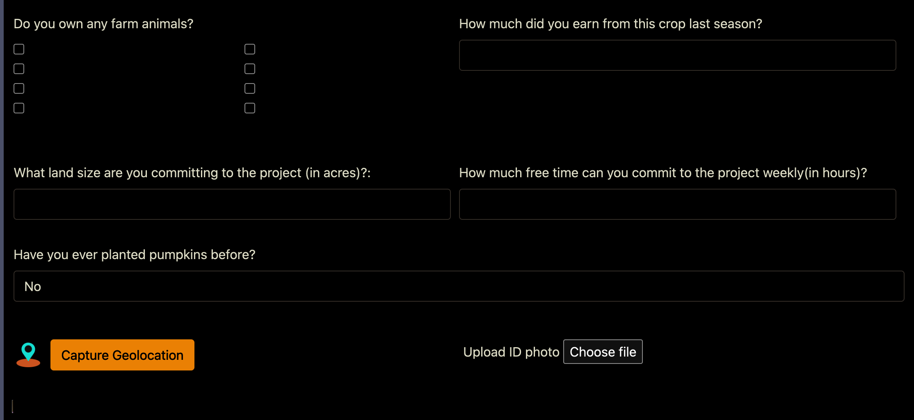

# Farmer Details System with using Laravel,htmls,CSS,Bootsrap and MySQL

A user authentication and authorization system with different user roles (admin and user) built using Laravel, and MySQL. This project provides a foundation for creating secure web applications with role-based access control.

## Table of Contents

-   [Features](#features)
-   [Usage](#usage)
-   [Database Setup](#database-setup)
-   [File Structure](#file-structure)
-   [Technologies Used](#technologies-used)
-   [Contributing](#contributing)
-   [License](#license)
-   [Contact](#contact)

## Features

-   User authentication with role-based access control.
-   Admin users can access index, edit, and user management pages.
-   Regular users can access only the new page.
-   Basic user session management.
-   Responsive design for various screen sizes.

cd your-project

## Usage

!Important
Before using this project, please contact me for access and further instructions.

## Database Setup

Create a MySQL database.

Import the database.sql file in the project directory into your MySQL database to create the necessary tables.

## File Structure

Explain the structure of your project's files and directories. For example:

public/: Contains static assets (CSS, images, etc.).
views/for rendering pages.
routes/Laravel routes for different pages and actions.
Main application file.

## Technologies Used

Laravel
MySQL
Bootstrap (for styling)
Contributing
Contributions are welcome! Feel free to open issues and pull requests.

## License

This project is licensed under the MIT License. See the LICENSE file for details.

## Contact

Author: Emma
GitHub: Emmabsy
Email: emaikuri@gmail.com
